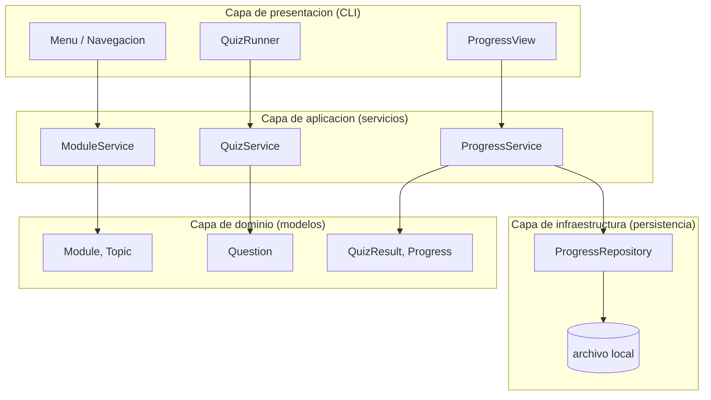
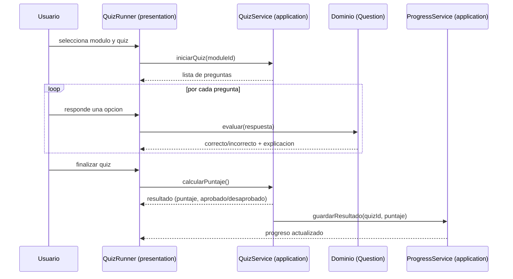
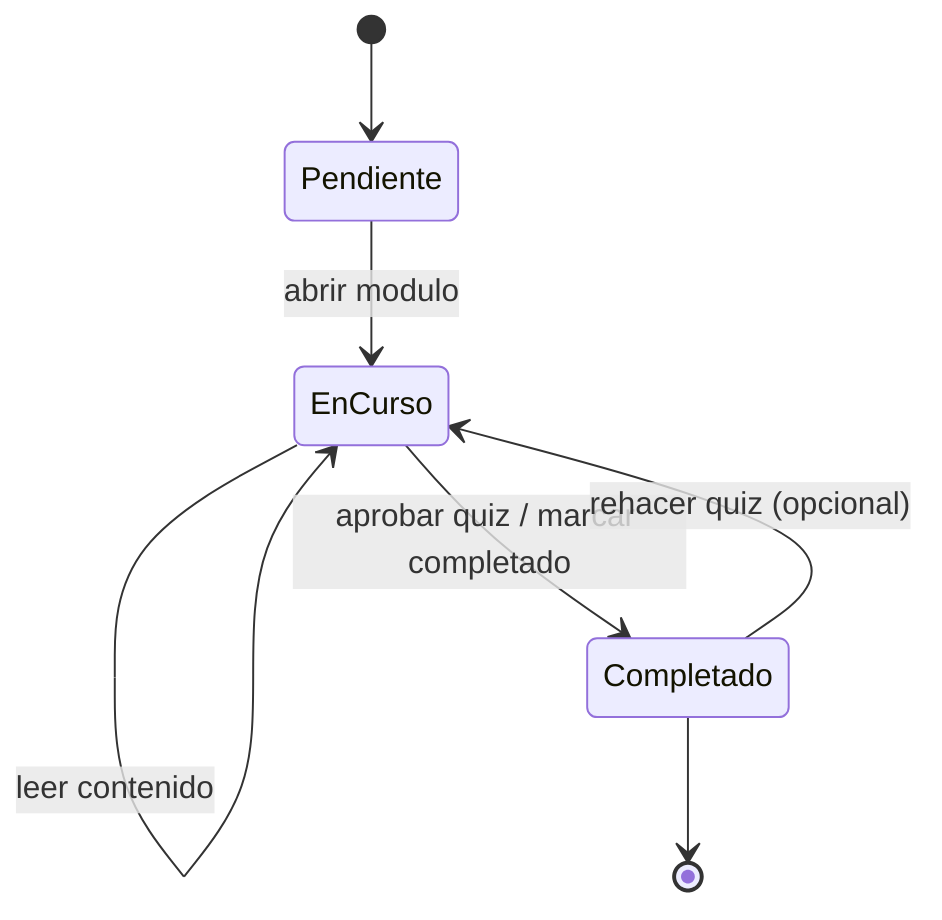
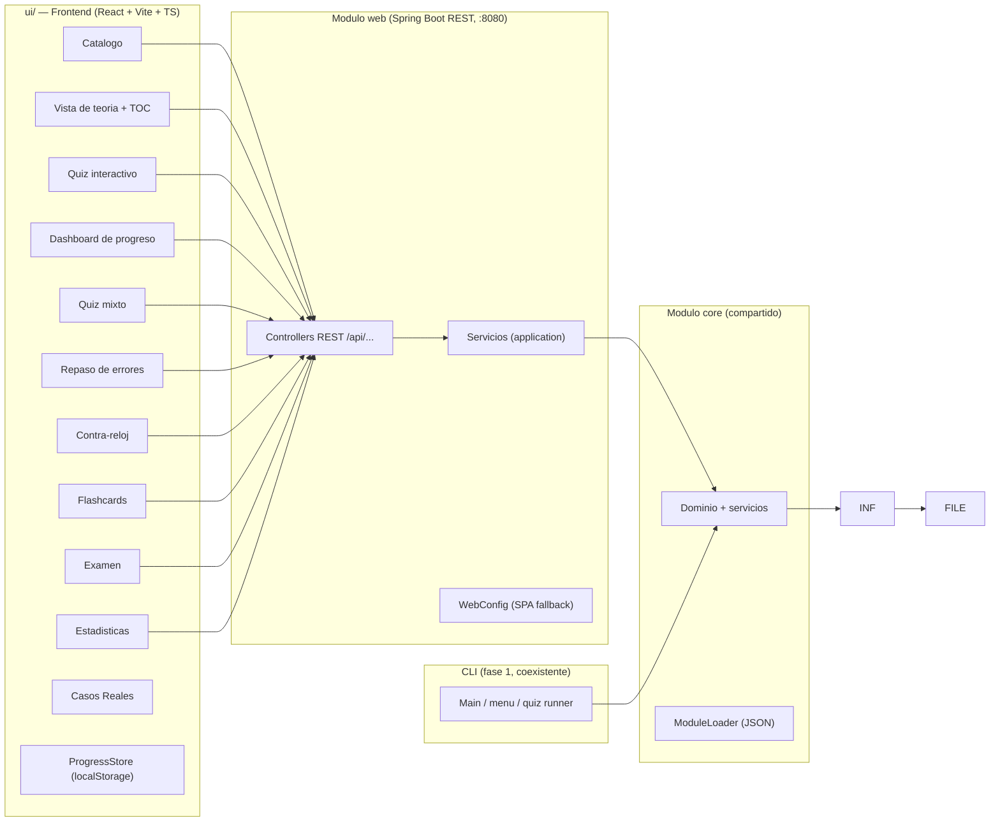

# Descripcion Tecnica

> Documento de diseno que complementa a [`functional-description.md`](./functional-description.md). Describe el stack, la justificacion de cada decision (ADR) y la arquitectura de la aplicacion. Es el contrato tecnico viviente: se actualiza junto con la descripcion funcional antes de cada iteracion de implementacion.

## 0. Como levantar el proyecto

**Puertos**: backend en `:8080`, frontend (Vite dev) en `:5174` con proxy de `/api` hacia `http://localhost:8080`. Navegador: `http://localhost:5174`.

**Ciclo de iteracion** (se repite cada vez que se modifica codigo del backend):

> El jar empaquetado `web\target\web-0.1.0-SNAPSHOT.jar` solo refleja el codigo de la **ultima compilacion**. Un jar viejo en ejecucion causa problemas como el `403 Invalid CORS request` cuando el CORS del front cambio. Por eso el orden siempre es: **matar -> recompilar -> levantar**.

```powershell
# 1. Matar backend actual
Get-NetTCPConnection -LocalPort 8080 -ErrorAction SilentlyContinue | ForEach-Object { Stop-Process -Id $_.OwningProcess -Force }

# 2. Recompilar e instalar dependencias internas + empaquetar web
& "C:\Program Files\JetBrains\IntelliJ IDEA 2025.3.1.1\plugins\maven\lib\maven3\bin\mvn.cmd" clean package -pl web -am -DskipTests -q

# 3. Levantar
java -jar web\target\web-0.1.0-SNAPSHOT.jar
```

**Primera vez / build completo** (solo cuando se quiere limpiar todo): `mvn.cmd clean install -DskipTests` en la raiz y luego `java -jar web\target\web-0.1.0-SNAPSHOT.jar`.

**Frontend** (otra terminal):

```bash
cd ui
npm run dev
```

**Nota sobre CORS**: si se cambia el puerto del front, tambien hay que actualizar `.allowedOrigins(...)` en `web/src/main/java/com/javatheory/web/config/AppConfig.java` y reiniciar el backend; de lo contrario Spring responde `403 Invalid CORS request`.

### Comandos de gestion de procesos (PowerShell)

**Ver que proceso escucha en un puerto** (muestra PID y proceso):

```powershell
Get-NetTCPConnection -LocalPort 8080 -State Listen | ForEach-Object { Get-Process -Id $_.OwningProcess | Select-Object Id, ProcessName }
```

Version corta (solo PID):

```powershell
Get-NetTCPConnection -LocalPort 8080 -State Listen | Select-Object LocalAddress, LocalPort, OwningProcess
```

**Matar el proceso que escucha en un puerto**:

```powershell
Get-NetTCPConnection -LocalPort 8080 -State Listen | ForEach-Object { Stop-Process -Id $_.OwningProcess -Force }
```

**Matar por PID explicito**:

```powershell
Stop-Process -Id <PID> -Force
```

## 1. Resumen

Aplicacion **CLI** escrita en **Java** para aprender/practicar Java de cara a entrevistas tecnicas. Arquitectura por capas simple y monolitica, ejecutable localmente sin servicios externos. La primera version se limita a: catalogo de modulos, contenido teorico, quiz de autoevaluacion y registro de progreso local.

## 2. Stack tecnologico

| Componente     | Tecnologia                                                                                       | Justificacion                                                                                                                                                                     |
| -------------- | ------------------------------------------------------------------------------------------------ | --------------------------------------------------------------------------------------------------------------------------------------------------------------------------------- |
| Lenguaje       | Java                                                                                             | Es el objeto de estudio; la app practica el propio lenguaje.                                                                                                                      |
| Version de JDK | **21 LTS** (fijada; instalada 21.0.9)                                                            | LTS actual, features modernas (records, `switch` expressions, text blocks) que son tema de entrevista.                                                                            |
| Build          | Maven, **modulo unico** en v1                                                                    | Estandar de facto en la industria Java; convenciones por defecto (layout, ciclo de vida), minimo config. La fase 2 migra a multi-modulo.                                          |
| Testing        | JUnit 5 (Jupiter)                                                                                | Estandar moderno para unit tests en Java.                                                                                                                                         |
| Dependencias   | Minimas; priorizar la **libreria estandar**                                                      | Reducir superficie de errores y mantener el foco en conceptos core de Java. Excepcion justificada: **Jackson** para persistencia JSON.                                            |
| UI (v1)        | CLI (consola, stdin/stdout)                                                                      | Definido en la descripcion funcional; sin GUI ni web en la primera version.                                                                                                       |
| UI (fase 2)    | **React + Vite + TypeScript** (frontend SPA en `ui/`) + **Spring Boot REST** (backend en `web/`) | UI web moderna; backend estandar de industria, muy relevante en entrevistas. TypeScript por ser el estandar actual de React y porque modela los DTOs del backend de forma tipada. |
| Persistencia   | **localStorage** del navegador (`javatheory_progress`) + Guest ID UUID v4 (`javatheory_guest_id`) | Sin backend para progreso; cada usuario tiene su progreso en su navegador. El backend sirve contenido y evalua quizzes. |

## 3. Justificacion de decisiones (ADR resumidos)

### D-01: Java como lenguaje

- **Motivo**: el proposito del repo es aprender Java; desarrollar la app en Java refuerza la teoria con practica real.
- **Alternativa descartada**: otro lenguaje (p. ej. Kotlin) — romperia el objetivo de estudio.

### D-02: Maven con modulo unico

- **Motivo**: el proyecto es pequeno; un solo `pom.xml` y layout `src/main/java` + `src/test/java` elimina complejidad de multi-modulo. Maven se elige sobre Gradle por ser mas predecible en proyectos simples y el estandar mas comun en entrevistas/empresas.
- **Consecuencia**: si la app creciera (p. ej. separar dominio de infraestructura en modulos), migrar a multi-modulo seria un cambio deliberado documentado en este spec.

### D-03: JUnit 5 (Jupiter)

- **Motivo**: estandar actual de testing en Java; soporta asserts modernos, parametrizados y nombres descriptivos. La verificacion esperada por iteracion es `mvn test`.

### D-04: CLI como interfaz en la primera version

- **Motivo**: la descripcion funcional prioriza contenido y mecanica de estudio sobre UX grafica. Una CLI es rapida de construir, testeable y suficiente para catalogo/teoria/quiz/progreso.
- **Alternativa descartada**: GUI/web — fuera de alcance en la primera version (ver no-alcance del funcional).

### D-05: Persistencia en localStorage (V5)

- **Motivo**: al hostear la app, el backend seria multi-usuario (todos comparten el mismo archivo). Mover el progreso a `localStorage` del navegador resuelve esto: cada usuario tiene su progreso en su navegador. Guest ID automatico (UUID v4) via `crypto.randomUUID()` para identificacion basica.
- **Alternativa descartada**: backend multi-usuario con sesiones (requiere Spring Auth y DB), localStorage + sync con backend (complejidad innecesaria para el alcance actual).
- **Consecuencia**: el backend依然 es necesario para contenido (modulos JSON) y evaluacion de quizzes, pero ya no persiste progreso.

### D-06: Dependencias minimas, priorizar la libreria estandar

- **Motivo**: menos dependencias = menos riesgo de breaking changes y mejor comprension del lenguaje. Solo se agregan librerias cuando el costo de la stdlib supera el beneficio (p. ej. Jackson para JSON).

### D-07: UI web (React + Vite + Spring Boot) en fase 2

- **Motivo**: al cerrar la CLI, la app suma una UI web moderna. React + Vite es el stack frontend mas difundido y Spring Boot el estandar backend de la industria Java (temas muy relevantes en entrevistas). La migracion a **multi-modulo Maven** (modulo `core` compartido + modulo `web`) permite que CLI y UI reutilicen el mismo dominio, los mismos servicios y el mismo `progress.json`.
- **Consecuencia**: el no-alcance "sin backend servidor" de v1 queda limitado a la primera version; la fase 2 agrega una API REST local (sin multiusuario ni autenticacion).

### D-08: Frontend como SPA React + Vite + TypeScript con navegacion por historial

- **Motivo**: una SPA con 10+ vistas no justifica una libreria de routing de terceros; la navegacion se resuelve con un custom hook (`useNavigation.ts`) que sincroniza el estado con `history.pushState`/`popstate`, permitiendo que el boton "Atras" del navegador funcione dentro de la SPA. TypeScript tipa los DTOs del backend (`ModuleSummary`, `ModuleDetail`, `QuizResponse`, `QuizResultResponse`, `ProgressResponse`) evitando errores de contrato entre front y back. Vite ofrece dev server con **proxy de `/api` hacia `http://localhost:8080`**, con lo que en desarrollo no hay CORS; igualmente se mantiene el mapping CORS para el puerto 5174 como red de seguridad.
- **Alternativa descartada**: react-router (dependencia extra innecesaria a este tamano) y JS plano (pierde el contrato tipado con el backend).

### D-09: Contrato REST por casos de uso (misma logica que la CLI)

- **Motivo**: los endpoints exponen exactamente los casos de uso de la CLI (UC-01 a UC-06) reutilizando `core` (servicios + persistencia). El quiz NO filtra las respuestas correctas: el frontend recibe las preguntas y envia solo los indices elegidos (`POST .../quiz`), recibiendo `score`, `total`, `passed` y feedback por pregunta. Devolver `correctIndexes` en la respuesta seria un leak del contrato, por eso se omite en `GET .../quiz`.

### D-10: Deploy en Render con Dockerfile multi-stage (V5)

- **Motivo**: Render soporta Docker nativamente. Un Dockerfile multi-stage (node → java) builda el frontend y backend en un solo paso, produciendo una imagen optimizada (~300MB JRE). SPA fallback via `WebConfig.java`确保 que recargar en rutas del SPA no devuelva 404.
- **Alternativa descartada**: Railway (similar pero Render tiene free tier mas generoso), deploy separado frontend/backend (mas complejidad de CORS y dos servicios).

## 4. Arquitectura de la aplicacion

### 4.1 Diagrama de capas



- **Presentacion**: se encarga de I/O con el usuario (consola). Sin logica de negocio.
- **Aplicacion**: orquesta casos de uso (UC del funcional), coordina dominio y persistencia.
- **Dominio**: modelos y reglas puras de Java (p. ej. calculo de puntaje), sin dependencia de consola ni archivos.
- **Infraestructura**: detalles tecnicos (lectura/escritura del progreso).

La regla de dependencia es **de adentro hacia afuera**: dominio no conoce a infraestructura ni presentacion; los servicios (aplicacion) dependen de interfaces de persistencia, no de la implementacion concreta.

### 4.2 Estructura de paquetes planeada

```
src/main/java/com/javatheory/
├── Main.java                 # punto de entrada de la CLI
├── presentation/             # menu, navegacion, quiz runner, vistas
├── application/              # servicios de casos de uso (Module/Quiz/ProgressService)
├── domain/                   # modelos: Module, Topic, Question, QuizResult, Progress
└── infrastructure/           # ProgressRepository (archivo local) + tests

src/test/java/com/javatheory/ # tests JUnit 5 (unitarios por capa)
```

### 4.3 Flujo del caso de uso UC-03/UC-04 (resolver y ver resultado del quiz)



### 4.4 Diagrama de estados del progreso de un modulo



### 4.5 Arquitectura objetivo (fase 2: UI web — V5)

En la fase 2 el proyecto pasa a **multi-modulo Maven**: el modulo `core` conserva dominio/servicios/infraestructura/contenido y el modulo `web` expone una API REST (Spring Boot) consumida por el frontend React + Vite. El progreso se persiste en **localStorage** del navegador (no en el backend). Deploy en **Render** via Dockerfile multi-stage.



### 4.6 Contrato REST (consumido por `ui/`)

| Metodo y ruta                     | Request body                                                               | Respuesta                                                                                                                                                                                                                  |
| --------------------------------- | -------------------------------------------------------------------------- | -------------------------------------------------------------------------------------------------------------------------------------------------------------------------------------------------------------------------- |
| `GET /api/modules`                | -                                                                          | `[{id, title, description, state}]` — `state` en `PENDING`/`IN_PROGRESS`/`COMPLETED`                                                                                                                                       |
| `GET /api/modules/{id}`           | -                                                                          | `{id, title, description, topics:[{id, title, content, examples:[string]}]}`; 404 si no existe                                                                                                                             |
| `GET /api/modules/{id}/quiz`      | -                                                                          | `{id, questions:[{id, text, options:[string], type}]}` — `type` en `SINGLE`/`MULTIPLE`/`TRUE_FALSE`; sin `correctIndexes`; 404 si no existe                                                                                |
| `POST /api/modules/{id}/quiz`     | `{"answers":[[int], ...]}`                                                 | `{score, total, passed, feedback:[{questionId, correct, explanation}]}`                                                                                                                                                    |
| `POST /api/modules/{id}/complete` | -                                                                          | `204 No Content`; 404 si no existe                                                                                                                                                                                         |
| `POST /api/quiz/mixed`            | `{"moduleIds":[string], "count":int}`                                      | `{id, questions:[{id, text, options:[string], type}]}` — quiz generado aleatoriamente; count se ajusta (clamp) al numero de preguntas disponibles si count > total; 400 si no hay preguntas disponibles                        |
| `POST /api/quiz/errors`           | `{}`                                                                       | `{id, questions:[{id, text, options:[string], type}]}` — solo preguntas con < 2 aciertos consecutivos; 400 si no hay pendientes                                                                                            |
| `POST /api/quiz/submit`           | `{"quizId", "moduleIds"?, "answers":[[int], ...], "durationSeconds"?:int}` | `{score, total, passed, feedback:[{questionId, correct, explanation}]}` — evalua, registra `questionStats` y `attempts`; `durationSeconds` opcional (V2-3)                                                                 |
| `GET /api/progress`               | -                                                                          | `{moduleStates:{modulo:state}, overallPercent:int, questionStats:{qId:{correct,wrong,streak}}, attempts:[{quizId,mode,score,total,passed,date}], streak:{current,best,lastDate,isStreakActive,isChallengeCompletedToday}}` |
| `DELETE /api/progress`            | -                                                                          | `204 No Content` — resetea todo el progreso a vacio                                                                                                                                                                        |
| `GET /api/stats`                  | -                                                                          | `{moduleId:{correct,wrong,avg,best}}` — estadisticas por modulo                                                                                                                                                            |
| `GET /api/streak`                 | -                                                                          | `{current, best, lastDate, isStreakActive, isChallengeCompletedToday}` — estado de racha                                                                                                                                   |
| `POST /api/streak/daily`          | `{}`                                                                       | `200 OK` — marca el reto del dia como completado                                                                                                                                                                           |
| `POST /api/quiz/daily`            | `{}`                                                                       | `{id, questions:[...]}` — reto diario (5 preguntas, deterministas por fecha)                                                                                                                                               |

### 4.7 Estructura del frontend (`ui/`)

```
ui/
├── index.html
├── package.json          # deps: react, react-dom, @chakra-ui/react; dev: vite, typescript
├── vite.config.ts        # dev server :5174 + proxy /api -> http://localhost:8080
├── tsconfig.json
└── src/
    ├── main.tsx          # bootstrap de React con ChakraProvider
    ├── App.tsx           # navegacion por historial (10 vistas)
    ├── api.ts            # cliente fetch tipado para la API REST
    ├── types.ts          # DTOs tipados espejo del backend
    ├── colors.ts         # tokens de color semanticos centralizados
    ├── theme.ts          # tema Chakra UI (dark mode, font, component defaults)
    ├── useNavigation.ts  # hook de navegacion con pushState/popstate
    ├── prism-darcula.css # tema de syntax highlighting
    ├── components/       # StateBadge, TimerBar, OrderQuestion, FlipCard,
    │                     # QuestionRenderer, QuestionBody, QuizFeedback, ErrorPage
    └── pages/            # CatalogPage, ModulePage, QuizPage, ProgressPage,
                          # MixedQuizPage, ErrorReviewPage, TimeAttackPage,
                          # FlashcardsPage, ExamPage, StatisticsPage
```

### 4.8 Arquitectura del frontend (refactor V3-5)

El refactor a Chakra UI (V3-5) introdujo:

- **`colors.ts`**: archivo centralizado con 13 tokens semanticos (`bg`, `surface`, `surfaceHover`, `border`, `borderSelected`, `accent`, `textPrimary`, `textMuted`, `error`, `success`, `codeBg`, `codeBorder`, `codeText`). Todos los componentes referencian estos tokens en vez de valores hex hardcodeados, facilitando cambios de tema.
- **`theme.ts`**: configura Chakra UI con dark mode, body background/color desde los tokens, y `Button` defaultProps.
- **`useNavigation.ts`**: hook que sincroniza el estado de navegacion (`view` + `moduleId`) con la API de historial del navegador (`pushState`/`popstate`). Las rutas se mapean a paths legibles (`/`, `/module/{id}`, `/quiz/{id}`, `/activities`, etc.). El boton "Atras" del navegador funciona como el boton "Volver" interno.
- **`QuestionRenderer` + `QuestionBody`**: componente compartido que unifica el renderizado de preguntas (SINGLE, MULTIPLE, TRUE_FALSE, ORDER) y reemplaza el codigo duplicado en 5 paginas. Usa `Radio`/`Checkbox` de Chakra en vez de inputs nativos HTML.
- **`QuizFeedback`**: componente reutilizable para la pantalla de resultado (puntaje, aprobado/desaprobado, feedback por pregunta).
- **Accesibilidad**: `FlipCard` tiene `role="button"`, `tabIndex`, `onKeyDown` y `aria-label`. `TimerBar` tiene `role="timer"` y `aria-label` con el tiempo restante.

En desarrollo se levantan dos procesos: `mvn -pl web spring-boot:run` (backend en `:8080`) y `npm run dev` en `ui/` (front en `:5174`). En produccion, `npm run build` genera el bundle estatico servible por cualquier servidor web (la integracion con Spring Boot sirviendo los estaticos queda fuera de alcance por ahora).

## 5. Modelo de datos (borrador de dominio)

| Concepto        | Atributos                                                                                      | Notas                                                                                                                                        |
| --------------- | ---------------------------------------------------------------------------------------------- | -------------------------------------------------------------------------------------------------------------------------------------------- |
| `Module`        | `id`, `title`, `description`, `topics[]`                                                       | Un modulo agrupa temas (ver funcional 3.1).                                                                                                  |
| `Topic`         | `id`, `title`, `content`, `examples[]`                                                         | Teoria + ejemplos.                                                                                                                           |
| `Question`      | `id`, `text`, `options[]`, `correctIndexes[]`, `explanation`, `type`                           | `SINGLE`, `MULTIPLE`, `TRUE_FALSE` o `ORDER`.                                                                                                |
| `QuestionType`  | `SINGLE`, `MULTIPLE`, `TRUE_FALSE`, `ORDER`                                                    | `ORDER` se evalua por secuencia exacta.                                                                                                      |
| `QuizResult`    | `quizId`, `score`, `total`, `passed`, `date`                                                   | Resultado de una resolucion.                                                                                                                 |
| `QuizMode`      | `NORMAL`, `MIXED`, `ERROR_REVIEW`, `TIME_ATTACK`, `EXAM`                                       | Modo en que se genero el quiz.                                                                                                               |
| `QuestionStats` | `correct`, `wrong`, `streak`                                                                   | Estadisticas por pregunta: aciertos, errores, aciertos consecutivos actuales.                                                                |
| `Attempt`       | `quizId`, `mode`, `moduleIds[]`, `score`, `total`, `passed`, `durationSeconds`, `date`         | Registro de un intento de quiz (V2-2+). `durationSeconds` se agrega en V2-3.                                                                 |
| `Streak`        | `current`, `best`, `lastDate`, `isStreakActive`, `isChallengeCompletedToday`                   | Racha diaria: dias consecutivos completando el reto del dia (V2-7).                                                                          |
| `Progress`      | `moduleStates[]`, `quizResults[]`, `questionStats{}`, `attempts[]`, `overallPercent`, `streak` | Persistido localmente. `questionStats` y `attempts` son campos V2-2; `streak` es campo V2-7. Todos backward compatible (default vacio/null). |

## 6. Decisiones tomadas

- **JDK 21 LTS** (fijada; instalada 21.0.9).
- **Maven** local, modulo unico en v1; **multi-modulo** en fase 2 (`core` + `web`).
- **Persistencia**: progreso en **localStorage** del navegador (`javatheory_progress`). Guest ID UUID v4 en `javatheory_guest_id`. El backend sirve contenido y evalua quizzes pero no persiste progreso.
- **Aprobacion de quiz**: **70%** minimo de respuestas correctas.
- **Progreso global**: modulos `completado` / total de modulos.
- **Root package**: `com.javatheory`.
- **Contenido**: teoria de tipo **explicacion extensa**, como archivos JSON en `src/main/resources`.
- **Prioridad de modulos**: Core Java -> POO -> Colecciones -> Streams/lambdas -> Concurrencia -> JVM/memoria -> SQL/JDBC -> Spring -> Testing -> Patrones de diseno -> REST/HTTP -> Git (12 modulos en total).
- **Frontend (fase 2)**: SPA React + Vite + **TypeScript** en `ui/`, sin router de terceros (navegacion por estado); dev server `:5174` con proxy `/api` -> `:8080`.
- **Contrato REST**: endpoints por caso de uso (ver 4.6); el quiz nunca expone `correctIndexes`.
- **Maquina de estados de un modulo**: `pending -> in_progress` al registrar un quiz no aprobado (o con `markInProgress`); `-> completed` al aprobar (>=70%) o con `POST .../complete`. La UI refleja el estado en catalogo, detalle y progreso (componente `StateBadge`).
- **Ruta configurable del archivo de progreso**: la propiedad `javatheory.progress` permite apuntar a otro archivo (default `~/.javatheory/progress.json`). La usan los tests de integracion (`target/test-progress/progress.json`) para **aislar el progreso real**; si la propiedad esta vacia se usa el default.
- **Formato `TRUE_FALSE` (V2-1)**: nuevo valor de `QuestionType`; se corrige con la misma regla de coincidencia exacta de conjuntos (`Question.isCorrect`), sin cambios en la evaluacion. El contenido exige minimo 2 preguntas `TRUE_FALSE` por modulo y se valida en `ModuleCatalogTest`. La UI los responde como toggle de dos botones.
- **V2-2: Quiz mixto + repaso de errores**: `QuizMode` enum (`NORMAL`, `MIXED`, `ERROR_REVIEW`) para distinguir origen del quiz. `QuestionStats` por pregunta (aciertos, errores, streak) se persiste en `questionStats` del `progress.json`. `Attempt` registra cada quiz con modo, modulos, puntaje y fecha. `POST /api/quiz/mixed` genera quiz aleatorio de N preguntas de modulos seleccionados; `POST /api/quiz/errors` recopila preguntas con < 2 aciertos consecutivos. Un endpoint unico `POST /api/quiz/submit` evalua y registra para cualquier modo. `progress.json` es backward compatible: campos V2-2 default vacio.
- **V2-3: Quiz contra-reloj**: `Attempt` gana campo `durationSeconds` (int, default 0). El timer corre en el frontend; al agotarse se cuenta como respuesta incorrecta y se muestra feedback igual que en modo normal. La API no maneja timer (es puro frontend). El `durationSeconds` se envia en el submit y se persiste para ranking local.
- **V2-4: Ordenar codigo (ORDER)**: nuevo `QuestionType.ORDER`; `options` contiene los bloques de codigo desordenados y `correctIndexes` define el orden correcto (ej. `[2, 0, 1]`). La evaluacion exige coincidencia exacta de secuencia. En el frontend se renderiza como lista reordenable (drag-and-drop HTML5 + fallback con botones arriba/abajo). Se agregan 1-2 preguntas ORDER por modulo al contenido JSON.
- **V2-5: Flashcards**: funcionalidad puramente de frontend; no requiere endpoints nuevos. El usuario selecciona modulos, el frontend carga las preguntas y las presenta como tarjetas que se voltean con animacion CSS 3D. La autoevaluacion sabia/no sabia es estado local del componente; las tarjetas "no sabia" se reciclan al final de la sesion.
- **V2-6: Examen simulado**: modo `EXAM` en `QuizMode`. Configuracion previa (modulos, cantidad de preguntas, tiempo total) en el frontend; se usa el endpoint existente `POST /api/quiz/mixed` para generar las preguntas. Navegacion forward-only y timer global son puramente frontend; al finalizar se envia el submit completo con `durationSeconds` del tiempo total. Sin feedback hasta el final (el frontend omite el feedback por pregunta y solo lo muestra al entregar).
- **V2-7: Racha diaria + estadisticas**: nuevo domain record `Streak` (current, best, lastDate, isStreakActive, isChallengeCompletedToday) persistido en `progress.streak`. Nuevo servicio `StatisticsService` calcula stats por modulo (aciertos, errores, mejor, promedio) a partir de `attempts` y `questionStats`. Nuevos endpoints: `GET /api/stats`, `GET /api/streak`, `POST /api/streak/daily`, `POST /api/quiz/daily`. El reto diario usa 5 preguntas deterministas por fecha (HashSet de seed + hashCode sobre el modulo). `Streak` lleva `@JsonIgnoreProperties(ignoreUnknown = true)` para manejar metodos computados `isStreakActive`/`isChallengeCompletedToday`.
- **V3-5: Refactor a Chakra UI**: migracion del frontend de estilos CSS manuales a **Chakra UI v2** con dark mode profesional. Se introdujo `colors.ts` (tokens semanticos centralizados), `theme.ts` (configuracion Chakra), `useNavigation.ts` (navegacion con `pushState`/`popstate` para que el boton "Atras" del navegador funcione dentro de la SPA). Se extrajeron componentes compartidos (`QuestionRenderer`+`QuestionBody`, `QuizFeedback`) eliminando duplicacion en 5 paginas. Se reemplazaron inputs HTML nativos por `Radio`/`Checkbox` de Chakra. Se corrigio `disabled` -> `isDisabled` en todos los `Button`. Se mejoro accesibilidad: `FlipCard` (keyboard, aria), `TimerBar` (role="timer"). Los endpoints de estadisticas (`getStats`, `getStreak`) se centralizaron en `api.ts` en vez de usar `fetch()` directo.

Ver el [`implementation-plan.md`](./implementation-plan.md) para la secuencia de fases y verificaciones.
